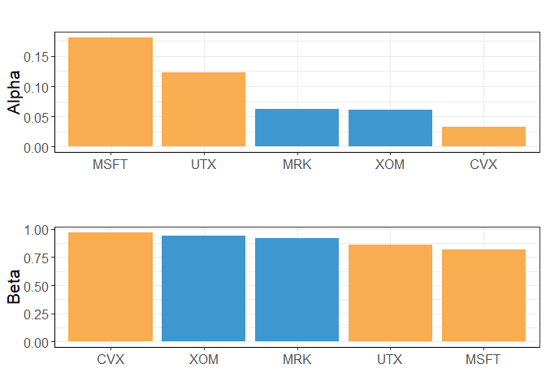
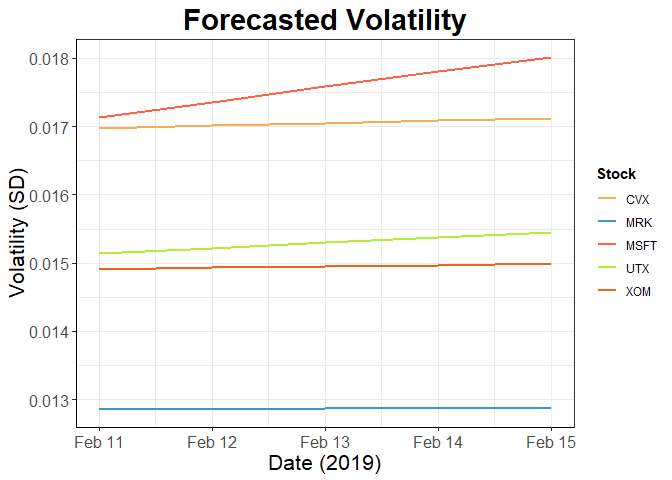
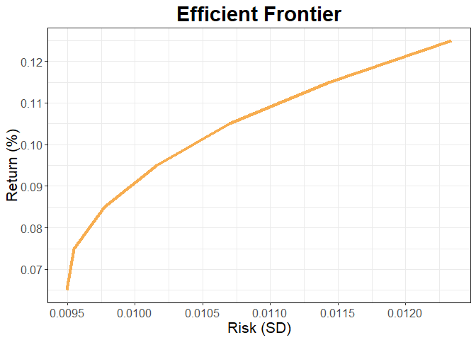

Portfolio Optimization
================

Load libraries

``` r
library(rvest) # web scraping
library(quantmod) # donwload stock data
library(dplyr) # data manipulation
library(TTR) # calculate returns
library(aTSA) # test arch effects
library(fDMA)# test arch effects
library(stringr) # string manipulation
library(fGarch) # garchFit
library(tidyr) # data manipulation
library(gurobi) # optimization
library(ggplot2) # plots
library(gridExtra) # plots in same grid
library(scales) # plot axis labels
filter <- dplyr::filter
select <- dplyr::select
```

Scrape stock symbols in DJIA from wikipedia.com

``` r
url <- 'https://en.wikipedia.org/wiki/Dow_Jones_Industrial_Average'
# read from wiki page
tbl <- read_html(url) %>% 
  html_nodes(css = 'table')
# convert to df
tbl <- tbl[2] %>% html_table() %>% as.data.frame()
```

Download stock data from yahoo.com

``` r
# create new environment for stock data
quotes <- new.env()
# download stock data to quotes environment
getSymbols(tbl$Symbol, src = 'yahoo', from = '2015-01-01', env = quotes)
```

    ##  [1] "MMM"  "AXP"  "AAPL" "BA"   "CAT"  "CVX"  "CSCO" "KO"   "DWDP" "XOM" 
    ## [11] "GS"   "HD"   "IBM"  "INTC" "JNJ"  "JPM"  "MCD"  "MRK"  "MSFT" "NKE" 
    ## [21] "PFE"  "PG"   "TRV"  "UNH"  "UTX"  "VZ"   "V"    "WMT"  "WBA"  "DIS"

Create xts object with closing prices of the 30 stocks in DJIA

``` r
# store stock data in quotes enirnoment into a list
q_list <- eapply(quotes, "[") 

# store the 1st stock's closing price in stocks
stocks <- q_list[[1]][,4] # 4th column is closing price

# 2nd to 30th stock in the list and just keep closing price. 
for (i in 2:length(q_list)) {
  stocks <- cbind(stocks, q_list[[i]][,4])
}

# subset to keep specified data range
stocks2 <- stocks["2017-02-01/2019-02-08"]

# saveRDS(stocks, "../data/stocks.RDS")
# stocks <- readRDS("../data/stocks.RDS")
```

Convert prices to returns

``` r
stocks_r <- stocks2

# for each stock replace prices with returns (percent changes)
for(stock in names(stocks_r) ){
  stocks_r[,stock] <- periodReturn(stocks2[,stock], 
                                   period = "daily", type='arithmetic')
}

# drop fist row bc its NA from returns calculation
stocks_r <- stocks_r[2:nrow(stocks_r)]

# stocks_r2 <- stocks_r
# names(stocks_r2) <- names(stocks_r2) %>% str_replace_all("\\.", "_")
# write.csv(stocks_r2, "../data/stocks_r.csv")
```

ARCH effect test for the stocks

``` r
# Test if the volatility is predictable, ie autocorrelations exits
# Null Hypothesis: all coefficients in a ARCH model is equal zero

# Arch test for the first stock 
# arch.test expects an arima object
# function doesn't allow you to choose the lag
# first row from arch.test contains results from testing lag 1-4
arch_test <- arch.test(arima(stocks_r[,1], order = c(0,0,0)), output = F) 
colnames(arch_test) <- c("order", "PQ_Stat", "p_value_PQ", 
                         "LM_Stat", "p_value_LM") 
arch_test <- arch_test %>% 
  as.data.frame() %>% slice(1)

# loop through the rest of the stocks and store results from arch effect test
# into a DF
for(i in 2:ncol(stocks_r)){
arch_test_temp <- arch.test(arima(stocks_r[,i], order = c(0,0,0)), 
                            output = F) 

colnames(arch_test_temp) <- c("order", "PQ_Stat", "p_value_PQ", 
                           "LM_Stat", "p_value_LM")
arch_test_temp <- arch_test_temp %>% 
  as.data.frame() %>% slice(1)

arch_test <- bind_rows(arch_test, arch_test_temp)
}

# add a column for the name of the stock associated with the test result
arch_test$stock <- names(stocks_r)

# Arrange by p value, smallest first
arch_test <- arch_test %>% arrange(desc(LM_Stat))

# results of LM test is inconsistent with PQ test. They're inversely related.
# Also different than SAS. maybe something wrong with the library
arch_test
```

    ##    order    PQ_Stat   p_value_PQ   LM_Stat p_value_LM      stock
    ## 1      4  0.8264051 9.348735e-01 2438.1423          0  WMT.Close
    ## 2      4  5.9537340 2.026302e-01 1626.5395          0  JNJ.Close
    ## 3      4  3.1937919 5.259342e-01 1597.2573          0   PG.Close
    ## 4      4  1.8868139 7.565669e-01 1338.4722          0  IBM.Close
    ## 5      4  7.8898148 9.569883e-02 1171.0055          0  NKE.Close
    ## 6      4  4.1414326 3.872033e-01  860.8073          0  MCD.Close
    ## 7      4  8.1549373 8.606471e-02  721.6479          0  WBA.Close
    ## 8      4  8.4980986 7.494488e-02  693.1916          0 INTC.Close
    ## 9      4  3.9208448 4.168243e-01  679.4060          0   GS.Close
    ## 10     4 29.6484306 5.770950e-06  664.2461          0  AXP.Close
    ## 11     4 12.3159787 1.514992e-02  657.9591          0 AAPL.Close
    ## 12     4 10.7276854 2.980109e-02  651.6733          0  MMM.Close
    ## 13     4  8.8144133 6.590941e-02  635.5892          0 DWDP.Close
    ## 14     4  2.6311355 6.213176e-01  626.7358          0   VZ.Close
    ## 15     4 15.7982227 3.302221e-03  523.8399          0   BA.Close
    ## 16     4 16.1943576 2.769151e-03  489.1533          0  CAT.Close
    ## 17     4 35.8598399 3.092313e-07  470.3270          0   HD.Close
    ## 18     4 36.1210961 2.732367e-07  470.1491          0  UTX.Close
    ## 19     4 38.7647635 7.791005e-08  423.6800          0  MRK.Close
    ## 20     4 19.1619790 7.303910e-04  423.4196          0  DIS.Close
    ## 21     4 33.6420509 8.823770e-07  410.5207          0 CSCO.Close
    ## 22     4 25.2630128 4.454001e-05  399.8040          0  TRV.Close
    ## 23     4 51.0411927 2.188412e-10  372.9764          0  PFE.Close
    ## 24     4 62.9074744 7.096546e-13  369.1287          0 MSFT.Close
    ## 25     4 31.6564166 2.248715e-06  359.0296          0  UNH.Close
    ## 26     4 71.8225515 9.325873e-15  347.5114          0    V.Close
    ## 27     4 26.4749896 2.537831e-05  327.8436          0   KO.Close
    ## 28     4 46.0184014 2.441231e-09  305.5120          0  CVX.Close
    ## 29     4 20.5907163 3.816654e-04  305.1332          0  JPM.Close
    ## 30     4 74.5281124 2.553513e-15  271.5748          0  XOM.Close

ARCH effect test for the stocks using fDMA package

``` r
p_values <- c()
stats <- c()
# loop through stocks test for arch effect on first lag. 
# save p value in a vector
for(i in 1:ncol(stocks_r)){
  temp <- archtest(stocks_r[,i] %>% as.numeric(), lag =1)
  p_values <- c(p_values, temp$p.value)
  stats <- c(stats, temp$statistic)
}
# create a data frame with the p-value and associated stock name
arch_test2 <- data.frame(stock = names(stocks_r), p_value = p_values,
                         test_stat = stats) %>%
  mutate(stock = as.character(stock))
# arrange by p-value
arch_test2 <- arch_test2 %>% arrange(p_values)

# results are different from the aTSA package. checked p-values in SAS for top 
# 5 ones with lowest p-value using fDMA and they are all below .0001
# will use these results bc it's testing the first lag rather than 1-4 and is 
# consistent with SAS
arch_test2
```

    ##         stock      p_value  test_stat
    ## 1   XOM.Close 7.275793e-15 60.5220757
    ## 2  MSFT.Close 1.130863e-10 41.5810114
    ## 3   MRK.Close 3.868443e-10 39.1781552
    ## 4   CVX.Close 8.249184e-10 37.7003008
    ## 5   UTX.Close 3.439006e-07 25.9860090
    ## 6  CSCO.Close 1.928899e-05 18.2582385
    ## 7   PFE.Close 4.630276e-05 16.5937747
    ## 8     V.Close 6.939737e-05 15.8272086
    ## 9   DIS.Close 1.339736e-04 14.5850440
    ## 10  JPM.Close 2.696928e-04 13.2699608
    ## 11   HD.Close 5.520131e-04 11.9312101
    ## 12  AXP.Close 1.130105e-03 10.6012618
    ## 13   BA.Close 3.300285e-03  8.6335460
    ## 14   KO.Close 4.369387e-03  8.1235518
    ## 15  MMM.Close 4.584508e-03  8.0364584
    ## 16  CAT.Close 6.422738e-03  7.4276999
    ## 17  UNH.Close 7.757211e-03  7.0886857
    ## 18  TRV.Close 7.897831e-03  7.0564964
    ## 19 AAPL.Close 8.709366e-03  6.8814750
    ## 20 DWDP.Close 3.424919e-02  4.4822207
    ## 21  NKE.Close 4.844046e-02  3.8946386
    ## 22  JNJ.Close 8.909247e-02  2.8906952
    ## 23 INTC.Close 9.743869e-02  2.7469738
    ## 24   GS.Close 1.438356e-01  2.1364372
    ## 25  WBA.Close 1.823785e-01  1.7781349
    ## 26   PG.Close 2.088111e-01  1.5796502
    ## 27   VZ.Close 2.673162e-01  1.2304670
    ## 28  IBM.Close 2.949690e-01  1.0968021
    ## 29  MCD.Close 3.860117e-01  0.7514684
    ## 30  WMT.Close 3.951348e-01  0.7230820

Select top 5 stocks based on smallest p value from LM test

``` r
# create vector of names of top 5 stocks
top5_names <- arch_test2 %>% slice(1:5) %>% pull(stock)
# select top 5 stocks  
top5_stocks_r <- stocks_r[,top5_names]
```

Fit Garch Models

``` r
# GARCH model with 1 AR and 1 MA term is typically best. The underlying dist
# is changed to find a better model

# create a data frame with specified cols for recording stats
fit_stat_df <- data.frame(AIC = NA, BIC = NA, SIC = NA, HQIC = NA, 
                          loglikelihood = NA, model = NA, stock = NA, 
                          alpha = NA, beta = NA)
# distribution types (normal, t, sym normal, sym t)
dists <- c('norm', 'std', 'snorm', 'sstd')

# create 4 types of garch(1,1) modeles for each stock and save results in a df
for(stock in names(top5_stocks_r)){
  for(dist in dists) {
    # fit garch model with specified dist
    fit <- garchFit(formula= ~ garch(1,1), data=top5_stocks_r[,stock],
                    cond.dist=dist, include.mean = FALSE)
    # save fit stats (AIC, SBC etc) from model
    fit_stat <- fit@fit$ics %>% as.matrix() %>% t() %>% as.data.frame() %>%
      mutate(loglikelihood = fit@fit$value*-1 %>% unname, model = dist, 
             stock = stock, 
             alpha = fit@fit$par['alpha1'] %>% unname,
             beta = fit@fit$par['beta1'] %>% unname)
    # add fit stats to df
    fit_stat_df <- bind_rows(fit_stat_df, fit_stat)
  }
}
```

Best model for each stock

``` r
# Best model for each stock in terms of lowest AIC
fit_stat_df2 <- fit_stat_df %>% slice(-1) %>%
  group_by(stock) %>%
  arrange(AIC) %>%
  mutate(rn = row_number()) %>%
  dplyr::filter(rn == 1) %>%
  dplyr::ungroup()

fit_stat_df2
```

    ## # A tibble: 5 x 10
    ##     AIC   BIC   SIC  HQIC loglikelihood model stock      alpha  beta    rn
    ##   <dbl> <dbl> <dbl> <dbl>         <dbl> <chr> <chr>      <dbl> <dbl> <int>
    ## 1 -6.38 -6.34 -6.38 -6.36         1623. std   XOM.Close 0.0607 0.939     1
    ## 2 -6.32 -6.28 -6.32 -6.30         1610. sstd  UTX.Close 0.123  0.865     1
    ## 3 -6.31 -6.27 -6.31 -6.29         1606. std   MRK.Close 0.0620 0.922     1
    ## 4 -6.05 -6.01 -6.05 -6.03         1542. sstd  CVX.Close 0.0328 0.971     1
    ## 5 -5.94 -5.90 -5.94 -5.93         1515. sstd  MSFT.Clo~ 0.181  0.819     1

Plots for parameters / stats of each stock

``` r
# format model types and stock symbols
fit_stat_df2 <- fit_stat_df2 %>% 
  mutate(Model = ifelse(model == "std", "t-Garch", "QGarch-t"),
         stock = str_replace_all(stock, "\\..+", "")) 

# alpha
a_p <- ggplot(fit_stat_df2, aes(x = reorder(stock, -alpha), y = alpha, fill = Model)) +
  geom_col() +
  scale_fill_manual(values=c("#F7AD50", "#3F97D0")) +
  labs(title = "", x = "", y = "Alpha") +
  theme_bw() +
  theme(plot.title = element_text(hjust = .5, size = 22, face = "bold"),
        axis.text=element_text(size=12),
        axis.title=element_text(size=16),
        axis.line = element_line(colour = "black"),
        legend.position = "none") 

# Beta
b_p <- ggplot(fit_stat_df2, aes(x = reorder(stock, -beta), y = beta, fill = Model)) +
  geom_col() +
  scale_fill_manual(values=c("#F7AD50", "#3F97D0")) +
  labs(title = "", x = "", y = "Beta") +
  theme_bw() +
  theme(plot.title = element_text(hjust = .5, size = 22, face = "bold"),
        axis.text=element_text(size=12),
        axis.title=element_text(size=16),
        axis.line = element_line(colour = "black"),
        legend.position = "none")

# loglilihood
ll_p <- ggplot(fit_stat_df2, aes(x = reorder(stock, -loglikelihood), 
                         y = loglikelihood, fill = Model)) +
  geom_col() +
  scale_fill_manual(values=c("#F7AD50", "#3F97D0")) +
  labs(title = "", x = "", y = "Log Likelihood") +
  theme_bw() +
  theme(plot.title = element_text(hjust = .5, size = 22, face = "bold"),
        axis.text=element_text(size=12),
        axis.title=element_text(size=16),
        axis.line = element_line(colour = "black"),
        legend.position = "none") 

grid.arrange(a_p, b_p, ncol=1)  
```



Fit best model for each stock

``` r
# fit best model for each stock
XOM_fit <- garchFit(formula= ~ garch(1,1), data=top5_stocks_r[,'XOM.Close'],
                    cond.dist="std", include.mean = FALSE)

UTX_fit <- garchFit(formula= ~ garch(1,1), data=stocks_r[,'UTX.Close'],
                    cond.dist="sstd", include.mean = FALSE)

MRK_fit <- garchFit(formula= ~ garch(1,1), data=stocks_r[,'MRK.Close'],
                    cond.dist="std", include.mean = FALSE)

CVX_fit <- garchFit(formula= ~ garch(1,1), data=stocks_r[,'CVX.Close'],
                    cond.dist="sstd", include.mean = FALSE)

MSFT_fit <- garchFit(formula= ~ garch(1,1), data=stocks_r[,'MSFT.Close'],
                    cond.dist="sstd", include.mean = FALSE)
```

5 day volatility forecast

``` r
# create df with 5 day forecast of volatitlity for each stock
sd_forecast <- data.frame(XOM = predict(XOM_fit, n.ahead = 5) %>%   
                            pull(standardDeviation),
                          UTX = predict(UTX_fit, n.ahead = 5) %>% 
                            pull(standardDeviation),
                          MRK = predict(MRK_fit, n.ahead = 5) %>% 
                            pull(standardDeviation),
                          CVX = predict(CVX_fit, n.ahead = 5) %>% 
                            pull(standardDeviation),
                          MSFT = predict(MSFT_fit, n.ahead = 5) %>% 
                            pull(standardDeviation))
```

5 day volatility forecast plot

``` r
sd_forecast2 <- sd_forecast
sd_forecast2$Date <- seq(from = as.Date("2019/02/11"), 
                         to =as.Date("2019/02/15"), "days")

sd_forecast2 <- sd_forecast2 %>% gather(key = Stock, value = SD, -Date)

ggplot(sd_forecast2, aes(x = Date, y = SD, color = Stock)) +
  geom_line(size = 1) +
  scale_color_manual(values=c("#F7AD50", "#3F97D0", "tomato1", 
                             "olivedrab2", "#F26419", "#999999")) +
  labs(title = "Forecasted Volatility",  x = "Date (2019)", 
       y = "Volatility (SD)") +
  theme_bw() +
  theme(plot.title = element_text(hjust = .5, size = 22, face = "bold"),
        axis.text=element_text(size=12),
        axis.title=element_text(size=16),
        axis.line = element_line(colour = "black"),
        legend.title = element_text(face = "bold")) +
  scale_y_continuous(labels = comma)
```



Median forecasted variance and returns

``` r
# compute forecasted variance
var_forecast <- sd_forecast * sd_forecast

# df of median forecasted variance for each stock
med_var <- apply(var_forecast,2, median) %>% 
  as.matrix() %>% t() %>% as.data.frame()

# df of median returns for each stock
med_r <- top5_stocks_r %>% apply(2,median) %>% 
  as.matrix() %>% t() %>% as.data.frame()
# remove .Close from column names
names(med_r) <- names(med_r) %>% str_replace(".Close", "")

# df of median forecasted variance and historical median returns
var_r <- bind_rows(med_var, med_r)
var_r$measure <- c('variance', 'return')

# reorder columns to match column order in top_5_stocks_r
var_r <- var_r %>%
       select(names(top5_stocks_r) %>% 
                str_replace("\\..+", ""), measure)

# var_r %>% gather(key = stock, value = v, -measure)
```

Covariance matrix with forecasted variance

``` r
# create covarinace matrix of historical returns of top 5 stocks
cov_mtx <- cov(top5_stocks_r)
# replace diangonal entries of covariance mtx with zero
diag(cov_mtx) <- 0
# create diagonal matrix with forecasted median variance
var_mtx <- diag(var_r %>% filter(measure == "variance") %>% select(-measure))
# replace diagonal entries of covariance matrix with forecasted median variance
# This replaces historical variance with forecasted variance / volatility
cov_mtx <- cov_mtx + var_mtx 
```

``` r
saveRDS(returns, "../data/returns.rds")
saveRDS(cov_mtx, "../data/cov_mtx.rds")
```

Optimize portfolio

``` r
# mean returns
returns = var_r %>% filter(measure == "return") %>% 
  select(-measure) %>% as.numeric()

model <- list()

# Contraint mtx: 
# sum of weights = 1
# weighted sum of returns >= 0.0005 (min .05% return per day)
# weight >= 0 (can't be negative)
model$A <- matrix(c(rep(1,ncol(cov_mtx)),
                  returns),
                  nrow=2,byrow=T)
model$A <- rbind(model$A, diag(rep(1, ncol(cov_mtx))))
model$sense <- c('=', '>=', rep(">=", ncol(cov_mtx)))
model$rhs   <- c(1, .0005, rep(0, ncol(cov_mtx)))

# Objective function. minimize risk. aka covariance of weighed sum of stocks
# cov(p1r1 + ... + p5r5) where p are weights and r are stock returns
model$Q     <- cov_mtx
model$obj   <- c(rep(0,ncol(cov_mtx))) # coeficients for linear term
model$modelsense <- "min"

# run optimization
result <- gurobi(model, list())
```

    ## Optimize a model with 7 rows, 5 columns and 15 nonzeros
    ## Model has 15 quadratic objective terms
    ## Coefficient statistics:
    ##   Matrix range     [2e-04, 1e+00]
    ##   Objective range  [0e+00, 0e+00]
    ##   QObjective range [2e-04, 6e-04]
    ##   Bounds range     [0e+00, 0e+00]
    ##   RHS range        [5e-04, 1e+00]
    ## Presolve removed 5 rows and 0 columns
    ## Presolve time: 0.00s
    ## Presolved: 2 rows, 5 columns, 10 nonzeros
    ## Presolved model has 15 quadratic objective terms
    ## Ordering time: 0.00s
    ## 
    ## Barrier statistics:
    ##  Free vars  : 4
    ##  AA' NZ     : 1.500e+01
    ##  Factor NZ  : 2.100e+01
    ##  Factor Ops : 9.100e+01 (less than 1 second per iteration)
    ##  Threads    : 1
    ## 
    ##                   Objective                Residual
    ## Iter       Primal          Dual         Primal    Dual     Compl     Time
    ##    0   2.64074448e+05 -2.64074448e+05  5.00e+03 2.03e-07  1.00e+06     0s
    ##    1   2.82815081e+03 -2.86247575e+03  1.84e+02 7.44e-09  3.72e+04     0s
    ##    2   2.85450082e-03 -3.65733227e+01  1.65e-01 6.67e-12  3.95e+01     0s
    ##    3   1.49626096e-04 -2.62038320e+01  1.65e-07 6.07e-18  4.37e+00     0s
    ##    4   1.49624798e-04 -2.62450444e-02  1.20e-12 4.24e-15  4.40e-03     0s
    ##    5   1.49072255e-04 -6.76431128e-05  8.07e-15 7.89e-17  3.61e-05     0s
    ##    6   1.00215508e-04 -1.84265330e-04  4.16e-17 1.73e-18  4.74e-05     0s
    ##    7   9.23630280e-05  6.00505378e-05  3.47e-18 3.04e-18  5.39e-06     0s
    ##    8   9.01736066e-05  8.40772314e-05  6.25e-17 8.67e-19  1.02e-06     0s
    ##    9   9.01199704e-05  9.00891253e-05  6.94e-18 4.34e-19  5.14e-09     0s
    ##   10   9.01199490e-05  9.01199181e-05  6.59e-17 8.67e-19  5.14e-12     0s
    ## 
    ## Barrier solved model in 10 iterations and 0.00 seconds
    ## Optimal objective 9.01199490e-05

``` r
result$status
```

    ## [1] "OPTIMAL"

``` r
# proportion to put in each stock
result_names <- c(names(top5_stocks_r))
names(result$x) <- result_names
opt_weights <- result$x %>% as.matrix()

# minimum risk (std deviation)
result$objval %>% sqrt()
```

    ## [1] 0.009493153

``` r
# sqrt of covariance of weighted sum (risk)
t(opt_weights) %*% cov_mtx %*% opt_weights %>% sqrt()
```

    ##             [,1]
    ## [1,] 0.009493153

``` r
# expected return
sum(result$x * returns)
```

    ## [1] 0.0006698501

Portfolio weights pie chart

``` r
weights_df <- data.frame(Stock = rownames(opt_weights), 
                         Weights = opt_weights * 100) %>%
  mutate(Stock = str_replace_all(Stock, "\\..+", ""))

 ggplot(weights_df, aes(x = "", y = Weights, fill = Stock)) +
  geom_bar(stat="identity", width=1) +
  coord_polar("y", start=0) +
  geom_text(aes(label = paste0(round(weights_df$Weights,2), "%")), 
            position = position_stack(vjust = .5)) +
  scale_fill_manual(values=c("#F7AD50", "#3F97D0", "tomato1", 
                             "olivedrab2", "#F26419", "#999999")) +
  labs(x = NULL, y = NULL, fill = NULL, title = "Portfolio Allocation") + 
  theme_void() + 
  theme(axis.line = element_blank(),
        axis.text = element_blank(),
        axis.ticks = element_blank(),
        plot.title = element_text(hjust = .5, size = 22, face = "bold"))
```


Efficient Frontier Calculation

``` r
# minimum risk (variance / volatility) for given level of min return

# vary the minimum return
min_returns <- c(seq(0.00065, .0013, .0001))
# constraint operators. 
# return is a binding constraint so use = instead of using >= as before
model$sense <- c('=', '=', rep(">=", ncol(cov_mtx)))


ef_return = vector(length = length(min_returns))
ef_risk = min_returns

# minimize risk for given minimum return
for (i in 1:length(min_returns))
{
  model$rhs <- c(1, min_returns[i], rep(0,ncol(cov_mtx)))
  result2 <- gurobi(model, list())
  ef_return[i] = sum(result2$x * returns)
  ef_risk[i] = sqrt(result2$objval)
  
}
```

Efficient frontier plot

``` r
ef <- data.frame(risk = ef_risk, return = ef_return*100)

ggplot(ef, aes(x = risk, y = return)) +
  geom_line(color = "#F7AD50", size = 1.5) +
  labs(title = "Efficient Frontier",
       x = "Risk (SD)",
       y = "Return (%)") +
  theme_bw() +
  theme(plot.title = element_text(hjust = .5, size = 22, face = "bold"),
        axis.text=element_text(size=12),
        axis.title=element_text(size=16),
        axis.line = element_line(colour = "black")) +
  scale_x_continuous( breaks = c(seq(.007,.014, .0005))) +
  scale_y_continuous( breaks = c(seq(.06,.14, .01))) 
```



actual 5 day return from portfolio

``` r
# 5 days of prices for the 5 stocks in portfolio
stocks_5day <- stocks["2019-02-11/2019-02-15", names(top5_stocks_r)]
day1 <- stocks_5day %>% head(1) %>% as.numeric()
day5 <- stocks_5day %>% tail(1) %>% as.numeric()
# 5 day return
return_5day <- (day5 - day1)/day1

#  5 day return from optimized portfolio
weighted_return <- sum(opt_weights * return_5day) * 100

#  5 day return from baseline portfolio of having equal weight in each stock
equal_weights <- c(rep(.2,5)) %>% as.matrix()
weighted_return_base <- sum(equal_weights * return_5day) *100
```

Portfolio growth over 5 days

``` r
# number of each stock to purchase. assuming investment = 100k and u can buy 
# partial stocks (for illustration purposes)
allocation <-(t(opt_weights) * 100000) / (stocks_5day %>% 
                                            head(1)) %>% as.numeric() 
allocation <- matrix(rep(allocation, 5),  nrow = 5, byrow = T)
# value of each stock holding
portfolio_value <- allocation * stocks_5day %>% as.data.frame()
# total portfolio value
portfolio_value$total = rowSums(portfolio_value)


# number of each stock to purchase for baseline portfolio. 
# assuming investment = 100k and u can buy partial stocks (for illustration purposes)
allocation_base <-(t(equal_weights) * 100000) / (stocks_5day %>% 
                                            head(1)) %>% as.numeric()
allocation_base <- matrix(rep(allocation_base, 5),  nrow = 5, byrow = T)
# value of each stock holding
portfolio_value_base <- allocation_base * stocks_5day %>% as.data.frame()
# total portfolio value
portfolio_value_base$total = rowSums(portfolio_value_base)
```

Portfolio growth chart

``` r
portfolios_5day <- data.frame(Date = rownames(portfolio_value),
                              Optimized = portfolio_value$total,
                              Baseline = portfolio_value_base$total) %>%
  mutate(Date = as.POSIXct(Date))

portfolios_5day <- portfolios_5day %>% 
  gather(key = Portfolio, value = Amount, -Date)

ggplot(portfolios_5day, aes(x = Date, y = Amount, color = Portfolio)) +
  geom_line(size = 1.3) +
  scale_colour_manual(values=c( "#3F97D0", "#F7AD50")) +
  labs(title = "Portfolio Growth",  x = "Date (2019)", 
       y = "Total Amount ($)") +
  theme_bw() +
  theme(plot.title = element_text(hjust = .5, size = 22, face = "bold"),
        axis.text=element_text(size=12),
        axis.title=element_text(size=16),
        axis.line = element_line(colour = "black"),
        legend.position = c(0.9, 0.2),
        legend.title = element_text(face = "bold")) +
  scale_y_continuous(labels = comma) 
```


actual 5 day risk from portfolio

``` r
# 6 days of price for the 5 stocks in portfolio
stocks_5day_r <- stocks["2019-02-8/2019-02-15", names(top5_stocks_r)]
# covert prices to returns
for(stock in names(stocks_5day_r)){
  stocks_5day_r[,stock] <- periodReturn(stocks_5day_r[,stock], period = "daily",
                                type='arithmetic')
}
# drop the first row
stocks_5day_r <- stocks_5day_r %>% tail(5)
# covariance matrix of 5 days of returns
cov_mtx_5day <- cov(stocks_5day_r)

# covariance of weighted sum of returns = risk 
# cov(p1r1 + ... + p5r5) where p are weights and r are returns
risk_5day <- t(opt_weights) %*% cov_mtx_5day %*% opt_weights %>% sqrt()
risk_5day_base <- t(equal_weights) %*% cov_mtx_5day %*% equal_weights %>% sqrt()
```

Plots of actual 5 day risk and return

``` r
return_5day_df <- data.frame(return = c(weighted_return, weighted_return_base),
                             portfolio = c("Optimized", "Baseline"))

risk_5day_df <- data.frame(risk = c(risk_5day , risk_5day_base), 
                           portfolio = c("Optimized", "Baseline"))

p1 <- ggplot(return_5day_df, aes(x = portfolio, y = return)) +
  geom_col(fill = "#F7AD50", color = '#3F97D0') +
  labs(
       y = "Return (%)",
       x = '') +
  theme_bw() +
  theme(plot.title = element_text(hjust = .5, size = 22, face = "bold"),
        axis.text=element_text(size=12),
        axis.title=element_text(size=16),
        axis.line = element_line(colour = "black")) +
  scale_y_continuous( breaks = c(seq(0,4, .75)))

p2 <- ggplot(risk_5day_df, aes(x = portfolio, y = risk)) +
  geom_col(fill = "#F7AD50", color = '#3F97D0') +
  labs(y = "Risk (SD)", x = "") +
  theme_bw() +
  theme(plot.title = element_text(hjust = .5, size = 22, face = "bold"),
        axis.text=element_text(size=12),
        axis.title=element_text(size=16),
        axis.line = element_line(colour = "black")) 

grid.arrange(p1, p2, ncol = 2)
```


